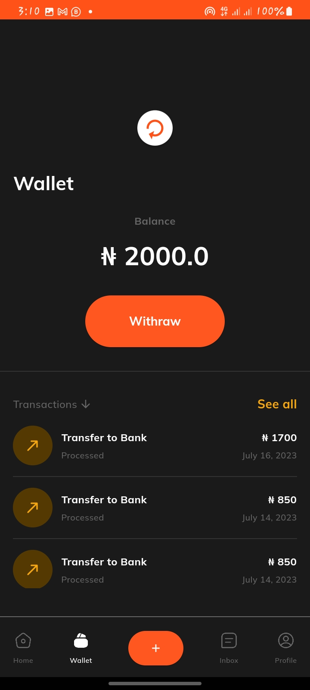

# Kooha Assessment Test - Flutter Mobile Application Developer

## Before you begin (if you'd run the code)
    To generate App Icon, run:
        1. flutter pub get || flutter pub run flutter_launcher_icons -f pubspec.yaml
        2. flutter pub get || flutter pub run flutter_launcher_icons

## App screenshots
<table>
  <tr>
    <td align="center">
      
    </td>
    <td align="center">
      
    </td>
    <td align="center">
      
    </td>
    <td align="center">
      
    </td>
  </tr>
  <tr>
    <td align="center">
      
    </td>
    <td align="center">
      
    </td>
    <td align="center">
      
    </td>
    <td align="center">
      
    </td>
  </tr>
  <tr>
    <td align="center">
      
    </td>
    <td align="center">
      
    </td>
    <td align="center">
      
    </td>
    <td align="center">
      
    </td>
  </tr>
  <tr>
    <td align="center">
      
    </td>
    <td align="center">
      
    </td>
    <td align="center">
      
    </td>
    <td align="center">
      
    </td>
  </tr>
</table>

## Get the app
Click [here](https://drive.google.com/file/d/1a6pf0vmWv6LsjH-URw3sy5im17zhCzZh/view?usp=drive_link)

## Introduction

Welcome to my assessment test submission for the position of Flutter Mobile Application Developer at Kooha. In this README, I'd like to address an issue I encountered with the login endpoint and explain my approach to handling it.

## Issue with Login Endpoint

During the assessment, I encountered an issue with the login endpoint. Specifically, it appears that the login API has difficulty recognizing the password in the sample login details as a string. Even when converting the password field to a string, the login request still doesn't work as expected. It seems that there might be a discrepancy in how the API handles password validation.

## Workaround

To address the issue with the login endpoint, I decided to implement a workaround. Since the login request is expected to provide a user token for subsequent API integrations, I created a custom API hosted on GitHub. This custom API mimics the exact response I would receive when making calls to the rest of the APIs that require a token to authorize access.

## Using the Custom API

To use the custom API for your assessment:

1. Access the custom API hosted on GitHub: [Kooha Custom API's](https://github.com/abdorll/kooha_api/)

2. Follow the instructions in the repository's README to set up and run the custom API locally.

3. Use the custom API as a substitute for the login endpoint to obtain the user token.

By following this approach, I aim to ensure that I have access to the user token required for making other API requests, despite the issue with the login endpoint.

## Conclusion

I would like to thank the Kooha team for considering my assessment submission. I understand that the login endpoint issue may have caused some inconvenience, and I appreciate your understanding. Please feel free to reach out if you have any questions or need further clarification on my approach.

Thank you for the opportunity, and I look forward to the next steps in the assessment process.

Sincerely,

Abdullah Opadeji O.
